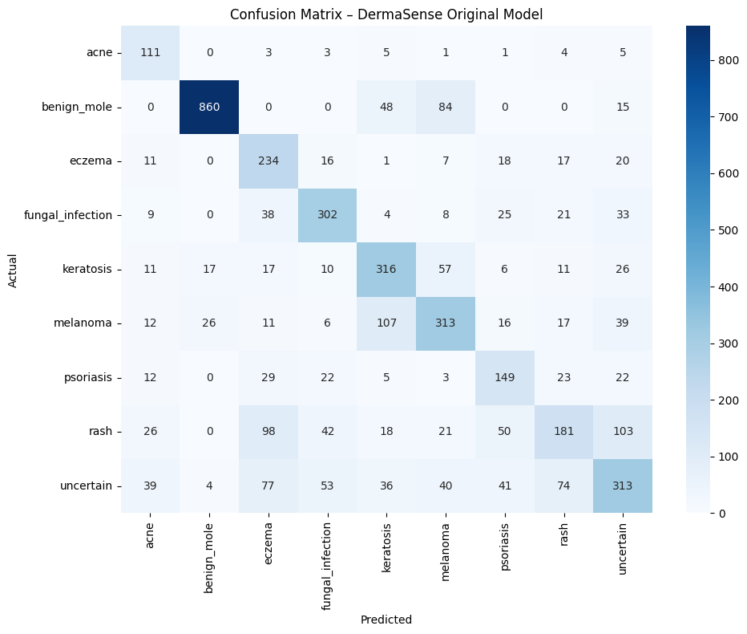
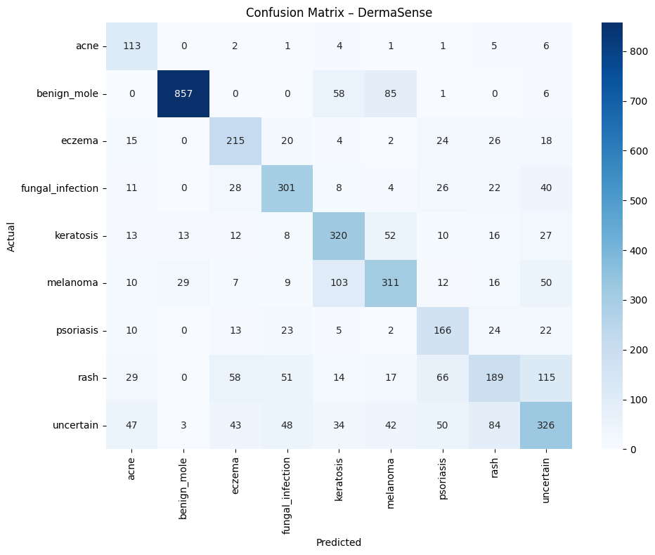

# 🧠 DermaSense: AI-Powered Skin Condition Classifier

This project is part of our submission to the Bolt.new Global Hackathon 2025. DermaSense is a privacy-focused, explainable AI tool that helps detect and classify 9 common skin conditions using deep learning.

## 📂 Dataset Summary

We trained and evaluated on dermatology datasets (HAM10000 + DermNet-derived images):

* **Total images**: \~29,300 (across train/val/test splits)
* **Classes (9)**: `acne`, `benign_mole`, `eczema`, `fungal_infection`, `keratosis`, `melanoma`, `psoriasis`, `rash`, `uncertain`

---

## 🧪 Model 1: Original EfficientNetB0 Baseline

### 📜 Description

* **Architecture**: EfficientNetB0 + classification head
* **Loss**: Categorical Crossentropy
* **Metrics**: Accuracy, Top-2 Accuracy
* **Epochs**: 20 (Phase 1) + 10 (fine-tuning)
* **Augmentation**: Basic geometric + brightness

### 📊 Validation Results

```
Final Val Accuracy:    60.38%
Final Val Top-2 Acc:   79.62%
Test Accuracy:         63.12%
Test Top-2 Accuracy:   87.81%
Test Loss:             0.6901
```

### 📋 Classification Report & Confusion Matrix



* **Weak Recall in**: `acne`, `psoriasis`, `eczema`
* **Overprediction**: `benign_mole`, `uncertain`

---

## 🔧 Model 2: Boundary Pushing Model

### 🆕 Key Improvements

* **Model**: EfficientNetB1 (larger backbone)
* **Loss**: Focal Loss (focuses on hard examples)
* **Advanced Augmentations**:

  * Color jitter
  * Texture noise
  * Gaussian noise
* **Regularization**:

  * Cosine Annealing
  * AdamW optimizer
* **Epochs**: 25 (frozen) + 3x12 (gradual unfreeze = 36) → 61 total

### 📊 Final Evaluation

```
Test Accuracy:         63.55%
Test Top-2 Accuracy:   80.83%
Test Loss:             0.8036
```

### 📋 Classification Report & Confusion Matrix



* 📈 Improved recall for `psoriasis` and `keratosis`
* 📉 `rash` and `uncertain` still hard to separate

---

## 🚀 Model 3: Targeted Improvements Model

### 🎯 Changes Before Running:

* ✅ Data Augmentation Now Targets Known Confusions:

  * Melanoma vs Keratosis → HSV augmentation
  * Eczema vs Rash → Texture noise
  * Acne → Edge sharpening
* ✅ Class Weighting Enhanced:

  * Boosted weights for underrepresented classes like `acne`, `psoriasis`, `eczema`
* ✅ Dataset Expansion:

```python
TARGET_SAMPLES = {
    'acne': 500,           # +367 needed
    'psoriasis': 450,      # +185 needed
    'eczema': 450,         # +126 needed
    'fungal_infection': 550,  # +110 needed
    'keratosis': 600,      # +129 needed
    'rash': 650,           # +111 needed
    'melanoma': 650,       # +103 needed
    'benign_mole': 1000,   # Already good
    'uncertain': 500       # -177 (reduce/reclassify)
}
```

* ✅ Architecture Adjustments:

  * Multi-scale pooling (avg + max)
  * Enhanced attention layers
  * Label smoothing + AUC metric

### 🧪 Model Plan

* **Epochs**: 30 (frozen) + 25 (partial unfreeze) + 25 (full fine-tune)
* **TTA**: Test-Time Augmentation with 8 variants

### 📊 Metrics To Be Collected:

* Standard Top-1 / Top-2 / AUC
* TTA-enhanced metrics
* Confusion Matrix & Report (to be added here)

---

## 🔍 Insights From Confusion Matrices

* `acne`, `psoriasis`, and `eczema` consistently underperform due to data scarcity
* Most confusion occurs between:

  * `melanoma` vs `keratosis`
  * `eczema` vs `rash`
  * `uncertain` vs everything

## 🧩 Next Steps

1. Finish dataset balancing
2. Run Model 3 with updated pipeline
3. Collect final metrics
4. Optionally ensemble Models 2 + 3 for hybrid voting

## 💡 Technologies Used

* TensorFlow / Keras
* EfficientNet
* Python (Colab)
* Matplotlib, Seaborn
* Markdown for documentation

## 📁 Repo Structure

```
📁 /processed_fixed
 ├── train/val/test/
     └── [9 class folders]
📄 original_model.keras
📄 best_dermasense_model_final.keras
📄 derma_targeted_improvements.keras
📷 confusion_matrix_original.png
📷 confusion_matrix_boundary.png
📷 [coming soon] Model 3 confusion
```

---

✅ This README documents the entire pipeline history, key changes, and the logic behind every major decision.

If you want to see epochs check the results file using google colab